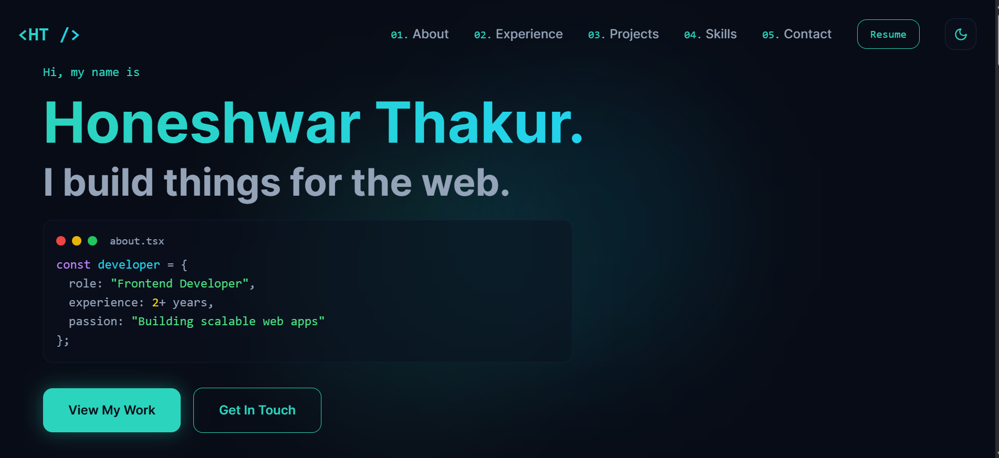
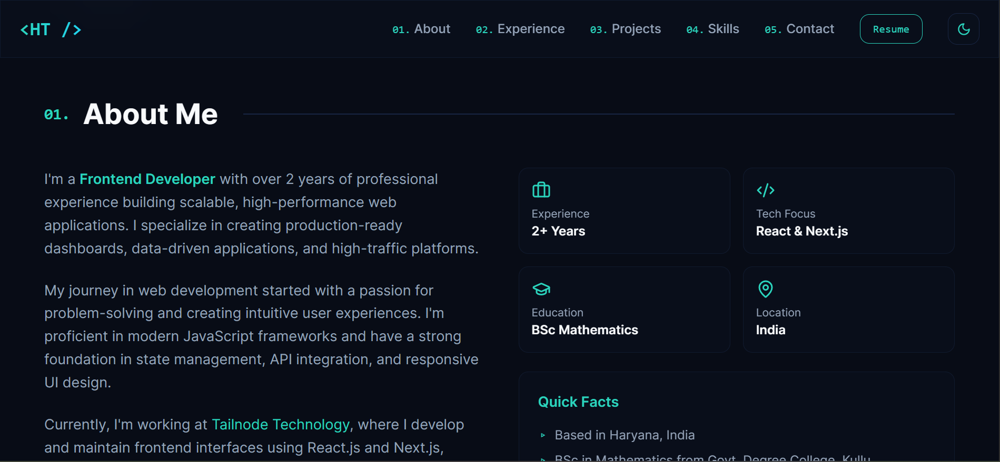
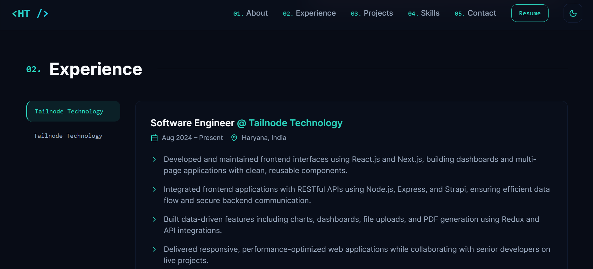
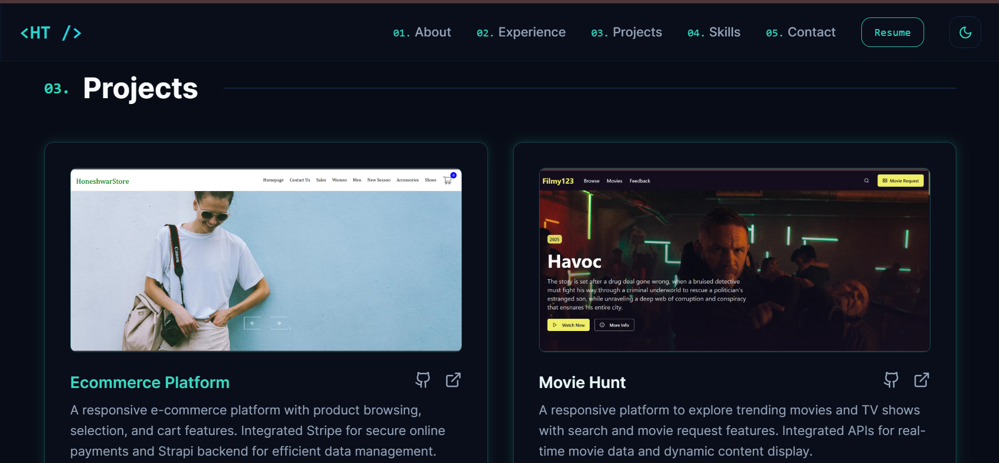
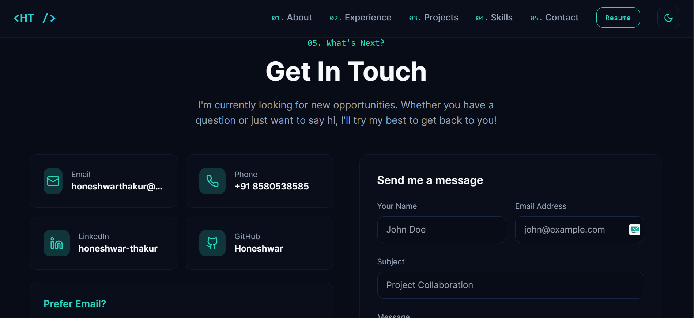

# Portfolio Website – Honeshwar Thakur 🚀

Personal portfolio website showcasing my work, skills, and experience as a **Frontend Developer** focused on building fast, responsive, and user-friendly web applications.

🔗 **Live Website:**  
https://honeshwarthakur.vercel.app/


## 📸 Screenshot

<p align="center">
  
</p>
<p align="center">
  
</p>
<p align="center">
  
</p>
<p align="center">
  
</p>
<p align="center">
  
</p>

> Clean, modern UI with smooth navigation and responsive design.


## 👨‍💻 About the Project

This portfolio is designed to:
- Highlight my **frontend development skills**
- Showcase **real-world projects**
- Make it easy for **recruiters & startups** to contact me
- Represent my work ethic, design sense, and coding style


## ✨ Features

- ⚡ Fast and responsive UI
- 📱 Mobile-first design
- 🧭 Smooth navigation
- 📂 Projects showcase with live links
- 📬 Contact section
- 🌙 Clean, minimal design


## 🛠 Tech Stack

- **React 18 + TypeScript** (Vite)
- **Tailwind CSS**, **Shadcn/UI**, **Radix UI**
- **React Router**, **Framer Motion**
- **React Query**, **React Hook Form**, **Zod**
- **Formspree**
- **Recharts**, **Lucide Icons**
- **Vitest**, **ESLint**, **PostCSS**


## 💡 Why This Stack?

This stack focuses on **performance, scalability, and developer experience**:
- Vite for lightning-fast builds
- Type-safe forms & validation with React Hook Form + Zod
- Accessible UI using Radix & Shadcn
- Scalable data fetching with React Query
- Supabase for rapid backend development


## 🚀 Getting Started (Local Setup)

```bash
git clone https://github.com/Honeshwar/portfolio.git
cd portfolio
npm install
npm run dev

